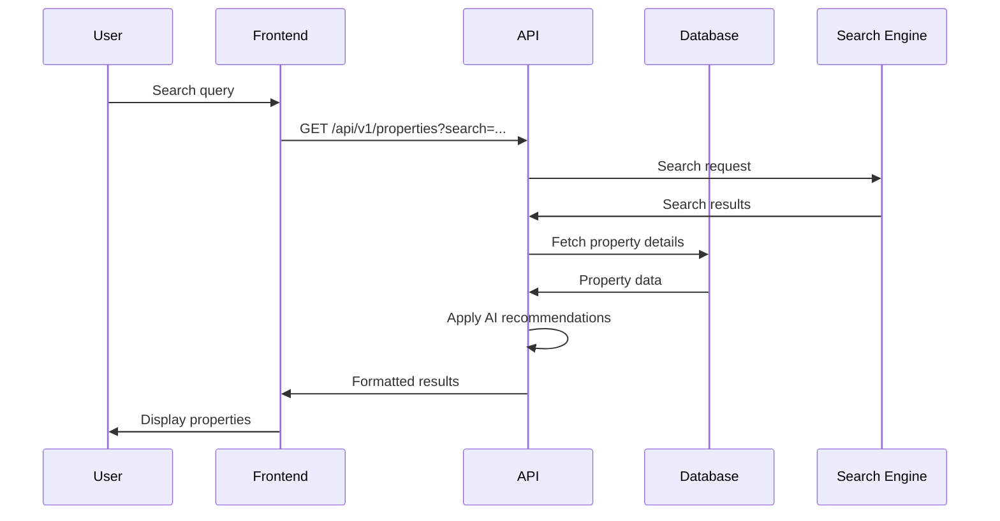
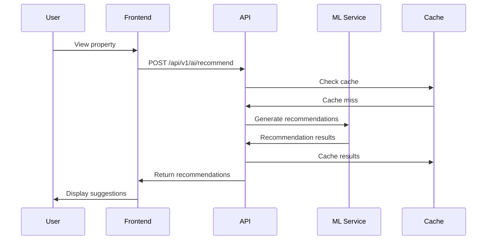
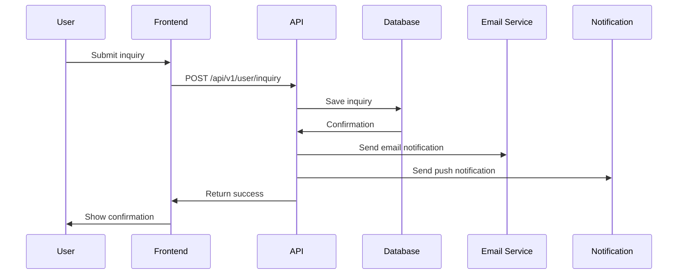

# NextBoomCity.com - API Endpoints & Data Flow

## API Architecture

**Framework**: Next.js API Routes with RESTful design
**Authentication**: JWT tokens with refresh mechanism
**Rate Limiting**: Implemented via middleware
**Caching**: Redis for frequently accessed data
**Versioning**: `/api/v1/` prefix for all endpoints

## Authentication Endpoints

### POST `/api/v1/auth/login`
- **Body**: `{ email, password }`
- **Response**: `{ token, refreshToken, user }`
- **Flow**: Validate credentials → Generate JWT → Return user data

### POST `/api/v1/auth/register`
- **Body**: `{ email, password, firstName, lastName, phone }`
- **Response**: `{ user, emailVerificationToken }`
- **Flow**: Create user → Send verification email → Return user data

### POST `/api/v1/auth/refresh`
- **Body**: `{ refreshToken }`
- **Response**: `{ token }`
- **Flow**: Validate refresh token → Generate new access token

### POST `/api/v1/auth/forgot-password`
- **Body**: `{ email }`
- **Response**: `{ success: true }`
- **Flow**: Generate reset token → Send reset email

### POST `/api/v1/auth/reset-password`
- **Body**: `{ token, newPassword }`
- **Response**: `{ success: true }`
- **Flow**: Validate token → Update password → Send confirmation

## Property Endpoints

### GET `/api/v1/properties`
- **Query Params**: `page, limit, location, type, price_min, price_max, bedrooms, amenities, sort`
- **Response**: `{ properties: [], total, page, limit, filters }`
- **Flow**: Build query → Apply filters → Sort results → Paginate → Return data

### GET `/api/v1/properties/:id`
- **Response**: `{ property: {...}, images: [], similar: [], analytics }`
- **Flow**: Fetch property → Get images → Find similar properties → Track view → Return data

### POST `/api/v1/properties`
- **Auth Required**: Agent/Admin
- **Body**: Property data with images
- **Response**: `{ property, success: true }`
- **Flow**: Validate data → Upload images → Save to database → Index in search

### PUT `/api/v1/properties/:id`
- **Auth Required**: Owner/Admin
- **Body**: Updated property data
- **Response**: `{ property, success: true }`
- **Flow**: Validate ownership → Update data → Re-index if needed

### DELETE `/api/v1/properties/:id`
- **Auth Required**: Owner/Admin
- **Response**: `{ success: true }`
- **Flow**: Soft delete → Update search index → Archive data

### GET `/api/v1/properties/search`
- **Query Params**: `q, location, filters`
- **Response**: `{ results: [], suggestions: [], total }`
- **Flow**: NLP processing → Build search query → Execute search → Return results

## AI/ML Endpoints

### POST `/api/v1/ai/recommend`
- **Body**: `{ userId, preferences, viewedProperties }`
- **Response**: `{ recommendations: [], scores: [], reasoning }`
- **Flow**: Analyze user behavior → Generate recommendations → Calculate scores → Return ranked list

### POST `/api/v1/ai/predict-price`
- **Body**: `{ propertyId, months_ahead }`
- **Response**: `{ predictions: [], confidence, factors }`
- **Flow**: Load property data → Run prediction model → Generate forecast → Return results

### POST `/api/v1/ai/investment-score`
- **Body**: `{ propertyId, userBudget, investmentHorizon }`
- **Response**: `{ score, breakdown, recommendation, risks }`
- **Flow**: Gather property data → Calculate factors → Generate score → Provide analysis

### POST `/api/v1/ai/chat`
- **Body**: `{ message, context, userId }`
- **Response**: `{ response, suggestions, actions }`
- **Flow**: Process message → Call OpenAI → Parse response → Extract actions

### POST `/api/v1/ai/ocr`
- **Body**: File upload (document image)
- **Response**: `{ extractedData, confidence, documentType }`
- **Flow**: Process image → Extract text → Parse document → Validate data

### GET `/api/v1/ai/infrastructure-impact`
- **Params**: `propertyId, infrastructureType`
- **Response**: `{ impact: number, timeline: [], factors: [] }`
- **Flow**: Calculate distance → Analyze project data → Predict impact → Return analysis

### POST `/api/v1/ai/religious-roi`
- **Body**: `{ propertyId, investmentAmount, holdingPeriod }`
- **Response**: `{ roi, occupancy, revenue, costs, risks }`
- **Flow**: Analyze religious data → Calculate footfall → Project revenue → Compute ROI

## Maps & Location Endpoints

### GET `/api/v1/maps/properties`
- **Query Params**: `bounds, filters, zoom`
- **Response**: `{ properties: [], clusters: [], heatmap: [] }`
- **Flow**: Calculate bounds → Query properties → Generate clusters → Return geo data

### GET `/api/v1/maps/heatmap`
- **Query Params**: `type, location, metric`
- **Response**: `{ data: GeoJSON, legend: [], filters }`
- **Flow**: Query analytics data → Generate heatmap → Apply styling → Return GeoJSON

### GET `/api/v1/maps/master-plan`
- **Params**: `locationId`
- **Response**: `{ geojson, metadata, layers }`
- **Flow**: Load master plan data → Process GeoJSON → Add metadata → Return map data

### GET `/api/v1/maps/infrastructure`
- **Query Params**: `type, location, status`
- **Response**: `{ projects: [], impact_zones: [], timeline }`
- **Flow**: Query infrastructure data → Calculate impact zones → Generate timeline → Return data

### GET `/api/v1/locations`
- **Query Params**: `type, search, limit`
- **Response**: `{ locations: [], total }`
- **Flow**: Search locations → Apply filters → Return paginated results

### GET `/api/v1/locations/:id`
- **Response**: `{ location, properties: [], growth_data, infrastructure }`
- **Flow**: Fetch location data → Get related properties → Load analytics → Return comprehensive data

## User & Profile Endpoints

### GET `/api/v1/user/profile`
- **Auth Required**
- **Response**: `{ user, preferences, savedProperties, searches }`
- **Flow**: Fetch user data → Get preferences → Load related data → Return profile

### PUT `/api/v1/user/profile`
- **Auth Required**
- **Body**: Updated user data
- **Response**: `{ user, success: true }`
- **Flow**: Validate data → Update user → Return updated profile

### GET `/api/v1/user/dashboard`
- **Auth Required**
- **Response**: `{ stats, recentActivity, recommendations, alerts }`
- **Flow**: Calculate stats → Get activity → Generate recommendations → Return dashboard data

### POST `/api/v1/user/save-property`
- **Auth Required**
- **Body**: `{ propertyId }`
- **Response**: `{ success: true }`
- **Flow**: Check if saved → Save property → Send notification

### POST `/api/v1/user/inquiry`
- **Body**: `{ propertyId, name, email, phone, message }`
- **Response**: `{ inquiry, success: true }`
- **Flow**: Create inquiry → Send notifications → Log analytics → Return confirmation

## Analytics & Reporting Endpoints

### GET `/api/v1/analytics/properties`
- **Auth Required**: Admin
- **Query Params**: `dateRange, location, type`
- **Response**: `{ views, inquiries, conversions, trends }`
- **Flow**: Query analytics data → Aggregate metrics → Generate trends → Return report

### GET `/api/v1/analytics/user-behavior`
- **Auth Required**: Admin
- **Query Params**: `userId, dateRange`
- **Response**: `{ searches, views, inquiries, patterns }`
- **Flow**: Analyze user data → Identify patterns → Generate insights → Return behavior data

### GET `/api/v1/analytics/market-trends`
- **Query Params**: `location, period`
- **Response**: `{ price_trends, demand_data, forecasts }`
- **Flow**: Query market data → Analyze trends → Generate forecasts → Return insights

## Content & Blog Endpoints

### GET `/api/v1/content/posts`
- **Query Params**: `category, tag, page, limit`
- **Response**: `{ posts: [], total, categories }`
- **Flow**: Query content → Apply filters → Paginate → Return posts

### GET `/api/v1/content/posts/:slug`
- **Response**: `{ post, related: [], comments }`
- **Flow**: Fetch post → Get related content → Load comments → Track view → Return data

### POST `/api/v1/content/comment`
- **Body**: `{ postId, comment, name, email }`
- **Response**: `{ comment, success: true }`
- **Flow**: Validate comment → Save to database → Send notifications → Return comment

## Calculator Endpoints

### POST `/api/v1/calculators/emi`
- **Body**: `{ principal, rate, tenure }`
- **Response**: `{ emi, total_amount, interest, schedule }`
- **Flow**: Calculate EMI → Generate payment schedule → Return breakdown

### POST `/api/v1/calculators/roi`
- **Body**: `{ property_cost, rental_income, expenses, appreciation }`
- **Response**: `{ roi, irr, cash_flow, payback_period }`
- **Flow**: Process inputs → Calculate metrics → Generate projections → Return analysis

### POST `/api/v1/calculators/tax`
- **Body**: `{ income_type, amount, location, user_type }`
- **Response**: `{ tax_amount, deductions, effective_rate }`
- **Flow**: Determine tax regime → Calculate tax → Apply deductions → Return breakdown

## Search & Filter Endpoints

### GET `/api/v1/search/suggestions`
- **Query Params**: `q, type`
- **Response**: `{ suggestions: [], categories }`
- **Flow**: Process query → Generate suggestions → Categorize → Return list

### POST `/api/v1/search/advanced`
- **Body**: Complex filter object
- **Response**: `{ results: [], facets, total }`
- **Flow**: Build complex query → Execute search → Generate facets → Return results

## Notification & Alert Endpoints

### GET `/api/v1/notifications`
- **Auth Required**
- **Response**: `{ notifications: [], unread_count }`
- **Flow**: Fetch user notifications → Mark as read → Return list

### POST `/api/v1/notifications/mark-read`
- **Auth Required**
- **Body**: `{ notificationIds }`
- **Response**: `{ success: true }`
- **Flow**: Update notification status → Return confirmation

### POST `/api/v1/alerts/subscribe`
- **Body**: `{ email, alert_type, criteria }`
- **Response**: `{ alert, success: true }`
- **Flow**: Create alert subscription → Send confirmation → Return alert

## Admin Endpoints

### GET `/api/v1/admin/dashboard`
- **Auth Required**: Admin
- **Response**: `{ stats, recent_activity, alerts }`
- **Flow**: Aggregate admin data → Generate dashboard → Return metrics

### POST `/api/v1/admin/properties/bulk`
- **Auth Required**: Admin
- **Body**: Array of property data
- **Response**: `{ created: [], errors: [] }`
- **Flow**: Process bulk data → Validate entries → Create properties → Return results

### GET `/api/v1/admin/analytics/export`
- **Auth Required**: Admin
- **Query Params**: `dateRange, format`
- **Response**: File download
- **Flow**: Generate report → Format data → Return file

## Data Flow Diagrams

### Property Search Flow


### AI Recommendation Flow


### Property Inquiry Flow


## Error Handling

All endpoints return standardized error responses:
```json
{
  "error": {
    "code": "VALIDATION_ERROR",
    "message": "Invalid input data",
    "details": {...},
    "timestamp": "2025-01-01T00:00:00Z"
  }
}
```

## Rate Limiting

- Public endpoints: 100 requests/minute
- Authenticated endpoints: 1000 requests/minute
- AI endpoints: 50 requests/minute
- Admin endpoints: 500 requests/minute

## Caching Strategy

- Static data (locations, categories): 24 hours
- Property listings: 1 hour
- AI predictions: 6 hours
- User-specific data: 30 minutes
- Real-time data: No cache

This comprehensive API design provides all necessary endpoints for the NextBoomCity.com platform, ensuring scalability, security, and optimal performance.