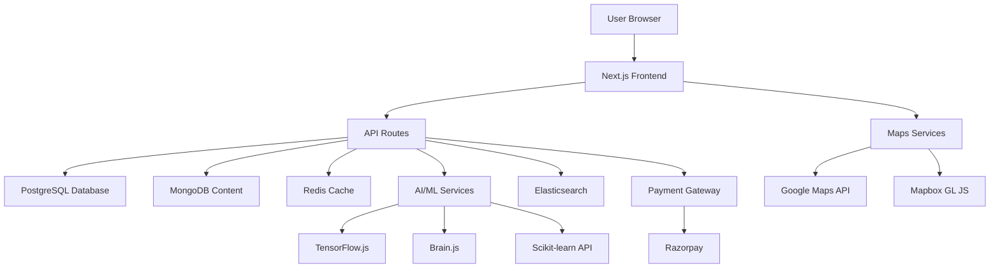
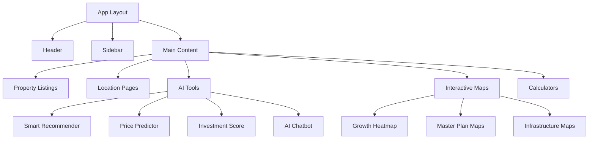

# NextBoomCity.com - System Architecture & Development Plan

## Overview
NextBoomCity.com is a premium, AI-powered real estate platform focusing on emerging Indian markets, with special emphasis on religious tourism hubs, smart cities, and infrastructure-led growth areas. The platform now supports both property sales and rentals, with comprehensive coverage including major cities like Mumbai, Delhi, Bangalore, Chennai, Hyderabad, Kolkata, Ahmedabad, and Goa.

## Tech Stack
- **Frontend**: Next.js 14 (SSR/SSG for SEO), React, Tailwind CSS, Shadcn UI, Framer Motion
- **Backend**: Next.js API Routes, Node.js/Express
- **Database**: PostgreSQL (primary data), MongoDB (flexible content), Redis (caching)
- **Maps**: Google Maps API, Leaflet.js, Mapbox GL JS
- **AI/ML**: TensorFlow.js, Brain.js, Scikit-learn (via API), Natural.js
- **3D/AR**: Three.js, A-Frame, Pannellum
- **Search**: Elasticsearch
- **Payments**: Razorpay
- **Hosting**: Vercel with Cloudflare CDN

## System Architecture



## Database Schema

### PostgreSQL Tables
- **properties**: id, title, description, location, type, listing_type (sale/rent), price, rent_amount, rent_period, size, amenities, rera_status, images, virtual_tour, ai_score, created_at
- **users**: id, email, name, role, preferences, created_at
- **locations**: id, name, city, state, type (primary/secondary), master_plan_data, growth_metrics
- **analytics**: id, property_id, views, inquiries, price_trends, date
- **ai_predictions**: id, property_id, predicted_price, confidence, factors

### MongoDB Collections
- **content**: blog_posts, market_reports, city_guides
- **user_sessions**: chat_history, search_queries
- **media**: images, videos, 3d_models

## Component Structure



## Development Phases

### Phase 1: Foundation (Week 1-2)
- Project setup and boilerplate
- Database schema implementation (including rental fields)
- Basic authentication
- Core property CRUD operations
- Seed initial location data (including Goa and Ahmedabad)

### Phase 2: Core Features (Week 3-6)
- Property listings with filters (sales and rentals)
- Rental property support with pricing and availability
- Location-specific pages (including Goa and Ahmedabad)
- Basic search functionality
- User dashboard

### Phase 3: AI/ML Integration (Week 7-10)
- Smart recommender system
- Price prediction engine
- AI chatbot implementation
- NLP search

### Phase 4: Interactive Features (Week 11-14)
- Maps integration (all 10+ types)
- 360° virtual tours
- AR visualization
- Charts and analytics

### Phase 5: Advanced Tools (Week 15-18)
- All calculators and tools
- Document OCR
- Investment analytics
- Multi-property comparison

### Phase 6: Content & SEO (Week 19-22)
- Blog system
- SEO optimization
- Content management
- Schema markup

### Phase 7: Monetization & Launch (Week 23-26)
- Payment integration
- Marketing features
- Performance optimization
- Deployment and testing

## API Endpoints Structure

```mermaid
graph LR
    A[Frontend] --> B[/api/properties]
    A --> C[/api/locations]
    A --> D[/api/ai]
    A --> E[/api/maps]
    A --> F[/api/calculators]
    B --> G[Property CRUD]
    C --> H[Location Data]
    D --> I[AI Predictions]
    E --> J[Map Data]
    F --> K[Calculations]
```

## Security Considerations
- JWT authentication
- Input validation and sanitization
- Rate limiting
- API key management for third-party services
- SSL/TLS encryption
- GDPR compliance for user data

## Performance Optimization
- Static generation for location pages
- Image optimization and CDN
- Database indexing and caching
- Lazy loading for heavy components
- Core Web Vitals monitoring

## Scalability Plan
- Microservices architecture for AI components
- Database sharding for multi-region data
- CDN for global content delivery
- Load balancing for API routes
- Monitoring and auto-scaling

## Testing Strategy
- Unit tests for components and utilities
- Integration tests for API endpoints
- E2E tests for critical user flows
- Performance testing for maps and AI features
- Accessibility testing (WCAG 2.1 AA)

## Deployment Pipeline
- GitHub Actions for CI/CD
- Vercel for frontend deployment
- Separate staging and production environments
- Automated testing on pull requests
- Rollback procedures

This architecture provides a scalable, maintainable foundation for NextBoomCity.com, enabling rapid development of AI-powered real estate features while ensuring optimal performance and SEO.