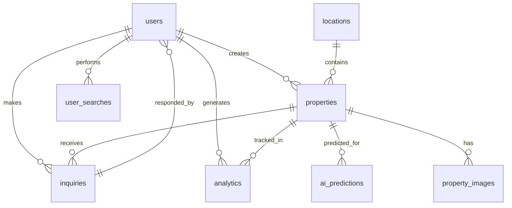

# NextBoomCity.com - Database Schema Design

## Database Architecture
- **Primary Database**: PostgreSQL (structured data, transactions, complex queries)
- **Secondary Database**: MongoDB (flexible content, blog posts, media)
- **Cache**: Redis (session data, API responses, frequently accessed data)

## PostgreSQL Schema

### Core Tables

#### users
```sql
CREATE TABLE users (
    id SERIAL PRIMARY KEY,
    email VARCHAR(255) UNIQUE NOT NULL,
    password_hash VARCHAR(255) NOT NULL,
    first_name VARCHAR(100),
    last_name VARCHAR(100),
    phone VARCHAR(20),
    role ENUM('user', 'agent', 'admin') DEFAULT 'user',
    avatar_url VARCHAR(500),
    preferences JSONB,
    email_verified BOOLEAN DEFAULT FALSE,
    phone_verified BOOLEAN DEFAULT FALSE,
    investment_budget DECIMAL(15,2),
    preferred_locations TEXT[],
    created_at TIMESTAMP DEFAULT CURRENT_TIMESTAMP,
    updated_at TIMESTAMP DEFAULT CURRENT_TIMESTAMP,
    last_login TIMESTAMP
);
```

#### properties
```sql
CREATE TABLE properties (
    id SERIAL PRIMARY KEY,
    title VARCHAR(255) NOT NULL,
    description TEXT,
    property_type ENUM('residential', 'commercial', 'plot', 'religious') NOT NULL,
    sub_type VARCHAR(100), -- apartment, villa, office, ashram, etc.
    listing_type ENUM('sale', 'rent') DEFAULT 'sale',
    location_id INTEGER REFERENCES locations(id),
    address TEXT,
    city VARCHAR(100),
    state VARCHAR(100),
    pincode VARCHAR(10),
    latitude DECIMAL(10,8),
    longitude DECIMAL(11,8),
    price DECIMAL(15,2), -- for sale
    rent_amount DECIMAL(15,2), -- for rent
    rent_period ENUM('monthly', 'yearly', 'daily') DEFAULT 'monthly',
    price_unit ENUM('INR', 'USD') DEFAULT 'INR',
    area DECIMAL(10,2), -- in sq ft
    area_unit ENUM('sqft', 'sqm', 'acre', 'hectare') DEFAULT 'sqft',
    bedrooms INTEGER,
    bathrooms INTEGER,
    parking_spaces INTEGER,
    floor_number INTEGER,
    total_floors INTEGER,
    year_built INTEGER,
    furnishing ENUM('unfurnished', 'semi_furnished', 'fully_furnished'),
    amenities TEXT[], -- array of amenity names
    features TEXT[], -- special features
    rera_registered BOOLEAN DEFAULT FALSE,
    rera_number VARCHAR(100),
    ownership_type ENUM('freehold', 'leasehold', 'cooperative'),
    possession_status ENUM('ready_to_move', 'under_construction', 'new_launch'),
    possession_date DATE,
    developer_name VARCHAR(255),
    project_name VARCHAR(255),
    virtual_tour_url VARCHAR(500),
    video_tour_url VARCHAR(500),
    ai_score DECIMAL(5,2), -- 0-100 investment score
    ai_prediction JSONB, -- future price predictions
    religious_significance TEXT, -- for religious properties
    infrastructure_impact JSONB, -- metro, airport, expressway data
    status ENUM('active', 'sold', 'inactive') DEFAULT 'active',
    featured BOOLEAN DEFAULT FALSE,
    premium_listing BOOLEAN DEFAULT FALSE,
    views_count INTEGER DEFAULT 0,
    inquiries_count INTEGER DEFAULT 0,
    created_by INTEGER REFERENCES users(id),
    created_at TIMESTAMP DEFAULT CURRENT_TIMESTAMP,
    updated_at TIMESTAMP DEFAULT CURRENT_TIMESTAMP
);
```

#### locations
```sql
CREATE TABLE locations (
    id SERIAL PRIMARY KEY,
    name VARCHAR(255) NOT NULL,
    city VARCHAR(100),
    state VARCHAR(100),
    district VARCHAR(100),
    type ENUM('primary', 'secondary', 'emerging') DEFAULT 'secondary',
    latitude DECIMAL(10,8),
    longitude DECIMAL(11,8),
    population BIGINT,
    area_sqkm DECIMAL(10,2),
    gdp_per_capita DECIMAL(10,2),
    growth_rate DECIMAL(5,2), -- annual growth %
    master_plan_url VARCHAR(500),
    master_plan_data JSONB, -- GeoJSON for maps
    infrastructure_projects JSONB, -- upcoming projects
    religious_sites JSONB, -- temples, pilgrim data
    airport_distance_km DECIMAL(8,2),
    metro_distance_km DECIMAL(8,2),
    expressway_distance_km DECIMAL(8,2),
    smart_city_status BOOLEAN DEFAULT FALSE,
    tier_classification ENUM('tier1', 'tier2', 'tier3'),
    investment_potential DECIMAL(3,1), -- 0-10 scale
    created_at TIMESTAMP DEFAULT CURRENT_TIMESTAMP,
    updated_at TIMESTAMP DEFAULT CURRENT_TIMESTAMP
);
```

#### property_images
```sql
CREATE TABLE property_images (
    id SERIAL PRIMARY KEY,
    property_id INTEGER REFERENCES properties(id) ON DELETE CASCADE,
    image_url VARCHAR(500) NOT NULL,
    alt_text VARCHAR(255),
    is_primary BOOLEAN DEFAULT FALSE,
    sort_order INTEGER DEFAULT 0,
    image_type ENUM('exterior', 'interior', 'amenity', 'location', 'floor_plan'),
    created_at TIMESTAMP DEFAULT CURRENT_TIMESTAMP
);
```

#### analytics
```sql
CREATE TABLE analytics (
    id SERIAL PRIMARY KEY,
    property_id INTEGER REFERENCES properties(id),
    event_type ENUM('view', 'inquiry', 'save', 'share', 'contact'),
    user_id INTEGER REFERENCES users(id),
    session_id VARCHAR(255),
    ip_address INET,
    user_agent TEXT,
    referrer_url VARCHAR(500),
    timestamp TIMESTAMP DEFAULT CURRENT_TIMESTAMP
);
```

#### ai_predictions
```sql
CREATE TABLE ai_predictions (
    id SERIAL PRIMARY KEY,
    property_id INTEGER REFERENCES properties(id),
    prediction_type ENUM('price_forecast', 'investment_score', 'roi_analysis'),
    predicted_value DECIMAL(15,2),
    confidence_score DECIMAL(5,2), -- 0-100
    prediction_date TIMESTAMP DEFAULT CURRENT_TIMESTAMP,
    valid_until DATE,
    factors JSONB, -- influencing factors
    model_version VARCHAR(50),
    created_at TIMESTAMP DEFAULT CURRENT_TIMESTAMP
);
```

#### user_searches
```sql
CREATE TABLE user_searches (
    id SERIAL PRIMARY KEY,
    user_id INTEGER REFERENCES users(id),
    search_query TEXT,
    filters JSONB,
    location_bounds JSONB, -- map bounds
    results_count INTEGER,
    timestamp TIMESTAMP DEFAULT CURRENT_TIMESTAMP
);
```

#### inquiries
```sql
CREATE TABLE inquiries (
    id SERIAL PRIMARY KEY,
    property_id INTEGER REFERENCES properties(id),
    user_id INTEGER REFERENCES users(id),
    name VARCHAR(255),
    email VARCHAR(255),
    phone VARCHAR(20),
    message TEXT,
    inquiry_type ENUM('general', 'price', 'availability', 'visit'),
    status ENUM('new', 'responded', 'closed') DEFAULT 'new',
    response TEXT,
    responded_by INTEGER REFERENCES users(id),
    responded_at TIMESTAMP,
    created_at TIMESTAMP DEFAULT CURRENT_TIMESTAMP
);
```

### Indexes
```sql
-- Performance indexes
CREATE INDEX idx_properties_location ON properties(location_id);
CREATE INDEX idx_properties_price ON properties(price);
CREATE INDEX idx_properties_rent ON properties(rent_amount);
CREATE INDEX idx_properties_listing_type ON properties(listing_type);
CREATE INDEX idx_properties_type ON properties(property_type);
CREATE INDEX idx_properties_status ON properties(status);
CREATE INDEX idx_properties_featured ON properties(featured);
CREATE INDEX idx_properties_ai_score ON properties(ai_score);

CREATE INDEX idx_locations_city ON locations(city);
CREATE INDEX idx_locations_type ON locations(type);

CREATE INDEX idx_analytics_property ON analytics(property_id);
CREATE INDEX idx_analytics_timestamp ON analytics(timestamp);

CREATE INDEX idx_ai_predictions_property ON ai_predictions(property_id);

-- Spatial indexes for location-based queries
CREATE INDEX idx_properties_location_coords ON properties USING gist (point(longitude, latitude));
CREATE INDEX idx_locations_coords ON locations USING gist (point(longitude, latitude));
```

## MongoDB Collections

### content (Blog posts, market reports, guides)
```javascript
{
  _id: ObjectId,
  title: String,
  slug: String,
  content: String, // HTML/Markdown
  excerpt: String,
  author: {
    id: Number, // reference to PostgreSQL users.id
    name: String,
    avatar: String
  },
  category: String, // market-trends, investment-guides, city-spotlights
  tags: [String],
  featured_image: String,
  seo: {
    meta_title: String,
    meta_description: String,
    keywords: [String],
    canonical_url: String
  },
  published: Boolean,
  publish_date: Date,
  last_modified: Date,
  reading_time: Number, // minutes
  views_count: Number,
  likes_count: Number,
  comments: [{
    user_id: Number,
    name: String,
    email: String,
    comment: String,
    date: Date,
    approved: Boolean
  }]
}
```

### market_reports
```javascript
{
  _id: ObjectId,
  title: String,
  period: String, // Q1-2025, Annual-2024
  type: String, // quarterly, annual, city-specific
  locations: [String], // cities covered
  key_findings: [String],
  price_trends: {
    data: {}, // chart data
    cities: [String]
  },
  investment_opportunities: [{}],
  government_policies: [{}],
  downloadable: Boolean,
  download_url: String,
  published_date: Date,
  created_by: Number // user id
}
```

### media_assets
```javascript
{
  _id: ObjectId,
  filename: String,
  original_name: String,
  path: String,
  url: String,
  type: String, // image, video, document
  mime_type: String,
  size: Number, // bytes
  dimensions: { width: Number, height: Number }, // for images
  alt_text: String,
  uploaded_by: Number,
  uploaded_at: Date,
  associated_with: {
    type: String, // property, blog, report
    id: String|Number
  }
}
```

### user_sessions
```javascript
{
  _id: ObjectId,
  user_id: Number,
  session_id: String,
  ip_address: String,
  user_agent: String,
  pages_visited: [{
    url: String,
    timestamp: Date,
    duration: Number // seconds
  }],
  searches: [{
    query: String,
    filters: {},
    timestamp: Date
  }],
  properties_viewed: [Number], // property ids
  chat_history: [{
    message: String,
    response: String,
    timestamp: Date,
    intent: String
  }],
  start_time: Date,
  last_activity: Date
}
```

## Redis Cache Structure

### Keys
- `property:{id}` - Property data (TTL: 1 hour)
- `location:{id}` - Location data (TTL: 24 hours)
- `search:{query_hash}` - Search results (TTL: 30 minutes)
- `user:{id}:session` - User session data (TTL: 24 hours)
- `analytics:daily:{date}` - Daily analytics (TTL: 7 days)
- `ai:prediction:{property_id}` - AI predictions (TTL: 1 day)

## Data Relationships



## Data Migration Strategy
1. Initial schema creation with PostgreSQL
2. MongoDB collection setup
3. Seed data for locations, initial properties
4. Content migration scripts for blog posts
5. Analytics data aggregation setup

## Backup & Recovery
- Daily PostgreSQL backups
- Weekly full MongoDB dumps
- Point-in-time recovery capability
- Cross-region backup storage
- Automated backup verification

This schema supports all platform features including AI predictions, analytics, multi-location support, and flexible content management while maintaining data integrity and performance.