# NextBoomCity.com - Page Structure & Navigation

## Site Structure Overview

```mermaid
graph TD
    A[Homepage] --> B[Properties]
    A --> C[Locations]
    A --> D[AI Tools]
    A --> E[Maps]
    A --> F[Investment Guides]
    A --> G[Market Reports]
    A --> H[Blog]
    A --> I[About]
    A --> J[Contact]

    B --> B1[All Properties]
    B --> B2[Residential]
    B --> B3[Commercial]
    B --> B4[Plots]
    B --> B5[Religious Properties]

    C --> C1[Faridabad]
    C --> C2[NCR]
    C --> C3[Dholera]
    C --> C4[Vrindavan]
    C --> C5[Ayodhya]
    C --> C6[Jewar]
    C --> C7[Secondary Cities]

    D --> D1[Smart Recommender]
    D --> D2[Price Predictor]
    D --> D3[Investment Score]
    D --> D4[AI Chatbot]
    D --> D5[NLP Search]
    D --> D6[Document OCR]

    E --> E1[Growth Heatmap]
    E --> E2[Master Plan Maps]
    E --> E3[Infrastructure Maps]
    E --> E4[Religious Tourism Maps]

    F --> F1[Religious Tourism Guide]
    F --> F2[Tier 2 Cities Guide]
    F --> F3[Smart Cities Guide]
    F --> F4[NRI Investment Guide]
```

## Detailed Page List

### Core Pages (10 pages)
1. `/` - Homepage
2. `/properties` - All Properties
3. `/properties/residential` - Residential Properties
4. `/properties/commercial` - Commercial Properties
5. `/properties/plots` - Plots & Land
6. `/properties/religious` - Religious Properties
7. `/about` - About Us
8. `/contact` - Contact Us
9. `/faq` - Frequently Asked Questions
10. `/careers` - Careers

### Location Pages (30+ pages)
#### Primary Cities (6 cities x 5-10 pages each = 30-60 pages)
- **Faridabad**:
  - `/locations/faridabad` - Overview
  - `/locations/faridabad/sectors` - Sector-wise properties
  - `/locations/faridabad/master-plan` - Master Plan 2031
  - `/locations/faridabad/investment-guide` - Investment Guide
  - `/locations/faridabad/projects` - Featured Projects

- **NCR (Gurgaon, Noida, Greater Noida)**:
  - `/locations/ncr` - NCR Overview
  - `/locations/ncr/gurgaon` - Gurgaon Properties
  - `/locations/ncr/noida` - Noida Properties
  - `/locations/ncr/greater-noida` - Greater Noida Properties
  - `/locations/ncr/metro-impact` - Metro Impact Analysis

- **Dholera Smart City**:
  - `/locations/dholera` - Dholera Overview
  - `/locations/dholera/master-plan` - Master Plan Maps
  - `/locations/dholera/investment-zones` - Investment Zones
  - `/locations/dholera/airport-zone` - Airport Influence Zone

- **Vrindavan**:
  - `/locations/vrindavan` - Vrindavan Overview
  - `/locations/vrindavan/temple-proximity` - Temple Proximity Properties
  - `/locations/vrindavan/ashram-land` - Ashram Land Listings
  - `/locations/vrindavan/parikrama-properties` - Parikrama Marg Properties
  - `/locations/vrindavan/iskcon-vicinity` - ISKCON Vicinity

- **Ayodhya**:
  - `/locations/ayodhya` - Ayodhya Overview
  - `/locations/ayodhya/ram-mandir-proximity` - Ram Mandir Proximity
  - `/locations/ayodhya/sarayu-riverfront` - Sarayu Riverfront Properties
  - `/locations/ayodhya/dharamshala-investment` - Dharamshala Investment
  - `/locations/ayodhya/airport-zone` - Airport Zone Properties

- **Jewar**:
  - `/locations/jewar` - Jewar Overview
  - `/locations/jewar/airport-zone` - Airport Zone Analysis
  - `/locations/jewar/expressway-properties` - Expressway Corridor Properties

#### Secondary Cities (20+ cities, 1-2 pages each = 20-40 pages)
- `/locations/lucknow` - Lucknow Properties
- `/locations/prayagraj` - Prayagraj Properties
- `/locations/varanasi` - Varanasi Properties
- `/locations/navi-mumbai` - Navi Mumbai Properties
- `/locations/pune` - Pune Properties
- `/locations/goa` - Goa Properties
- `/locations/indore` - Indore Properties
- `/locations/chandigarh` - Chandigarh Properties
- `/locations/gift-city` - Gift City Properties
- And 10+ more emerging markets

### AI Tools & Calculators (15+ pages)
1. `/tools/smart-recommender` - Smart Property Recommender
2. `/tools/price-predictor` - Price Prediction Engine
3. `/tools/investment-score` - Investment Score Generator
4. `/tools/ai-chatbot` - AI Property Assistant
5. `/tools/nlp-search` - Natural Language Search
6. `/tools/document-ocr` - Document Verification
7. `/tools/infrastructure-predictor` - Infrastructure Impact Predictor
8. `/tools/religious-tourism-roi` - Religious Tourism ROI Calculator
9. `/tools/government-tracker` - Government Initiative Tracker
10. `/tools/emi-calculator` - EMI Calculator
11. `/tools/home-loan-eligibility` - Home Loan Eligibility Calculator
12. `/tools/stamp-duty-calculator` - Stamp Duty Calculator
13. `/tools/roi-calculator` - ROI Calculator
14. `/tools/rental-yield-calculator` - Rental Yield Calculator
15. `/tools/nri-tax-calculator` - NRI Investment Tax Calculator
16. `/tools/property-tax-calculator` - Property Tax Calculator
17. `/tools/affordability-calculator` - Affordability Calculator
18. `/tools/area-converter` - Area Converter
19. `/tools/compare-properties` - Property Comparison Tool

### Interactive Maps (10+ pages)
1. `/maps/growth-heatmap` - All-India Growth Heatmap
2. `/maps/master-plans` - Master Plan Maps
3. `/maps/religious-tourism` - Religious Tourism Corridor Map
4. `/maps/expressways` - Expressway Network Map
5. `/maps/airports` - Airport Influence Zones
6. `/maps/metro-expansion` - Metro Expansion Map
7. `/maps/smart-cities` - Smart Cities Development Tracker
8. `/maps/infrastructure-timeline` - Infrastructure Timeline
9. `/maps/price-trends` - Price Trend Charts
10. `/maps/investment-hotspots` - Investment Hotspot Heatmap

### Investment Guides & Reports (10+ pages)
1. `/guides/religious-tourism-investment` - Religious Tourism Investment Guide
2. `/guides/tier-2-cities` - Tier 2 Cities Investment Guide
3. `/guides/smart-cities` - Smart Cities Investment Guide
4. `/guides/nri-investment` - NRI Investment Guide
5. `/guides/infrastructure-led-strategy` - Infrastructure-Led Investment Strategy
6. `/guides/dholera-investment` - Dholera Investment Guide
7. `/guides/ayodhya-investment` - Ayodhya Investment Guide
8. `/guides/vrindavan-investment` - Vrindavan Investment Guide
9. `/guides/jewar-airport-investment` - Jewar Airport Investment Guide
10. `/guides/emerging-markets` - Emerging Markets Investment Guide

### Market Reports & Analytics (5+ pages)
1. `/reports/quarterly-market-report` - Quarterly Market Report
2. `/reports/price-trends` - Price Trends Analysis
3. `/reports/city-comparisons` - City Comparison Dashboard
4. `/reports/investment-opportunities` - Investment Opportunities Report
5. `/reports/government-policies` - Government Policies & Subsidies

### Blog & Content (100+ pages)
- `/blog` - Blog Homepage
- `/blog/category/market-trends` - Market Trends
- `/blog/category/investment-guides` - Investment Guides
- `/blog/category/city-spotlights` - City Spotlights
- Individual blog posts (100+ articles, e.g., `/blog/property-investment-faridabad-2025`)

### Project Pages (10+ pages)
1. `/projects` - All Projects
2. `/projects/upcoming` - Upcoming Projects
3. `/projects/under-construction` - Under Construction Projects
4. `/projects/featured` - Featured Projects
5. `/projects/rera-approved` - RERA-Approved Projects
6. Individual project pages (dynamic, e.g., `/projects/project-name`)

### Specialized Sections
1. `/religious-tourism-hub` - Religious Tourism Hub
2. `/smart-cities` - Smart Cities Overview
3. `/nri-corner` - NRI Investment Corner
4. `/festival-calendar` - Festival Calendar with ROI Insights

### User Account Pages (5+ pages)
1. `/login` - Login
2. `/register` - Register
3. `/dashboard` - User Dashboard
4. `/saved-properties` - Saved Properties
5. `/investment-portfolio` - Investment Portfolio

### Legal & Compliance (5+ pages)
1. `/privacy-policy` - Privacy Policy
2. `/terms-of-service` - Terms of Service
3. `/disclaimer` - Disclaimer
4. `/refund-policy` - Refund Policy
5. `/complaints` - Complaints & Resolution

## Navigation Structure

### Main Navigation
- Home
- Properties
  - Residential
  - Commercial
  - Plots
  - Religious
- Locations
  - Primary Cities (dropdown)
  - Secondary Cities (dropdown)
- AI Tools
- Maps & Analytics
- Investment Guides
- Market Reports
- Blog

### Footer Navigation
- About Us
- Contact
- FAQ
- Careers
- Legal Pages
- Social Media Links

### Secondary Navigation
- User Account (Login/Register/Dashboard)
- Search Bar
- Floating WhatsApp Button
- Language Selector (if needed)
- Dark Mode Toggle

## SEO Considerations
- Clean URL structure with keywords
- Hierarchical organization for crawlability
- Internal linking between related pages
- XML sitemap generation for all pages
- Meta tags optimization for each page type

## Performance Optimization
- Static generation for location pages and blog posts
- Dynamic rendering for user-specific content
- Image optimization and lazy loading
- CDN for media assets
- Caching strategies for API responses

This page structure provides comprehensive coverage of all required features while maintaining logical navigation and optimal SEO architecture.